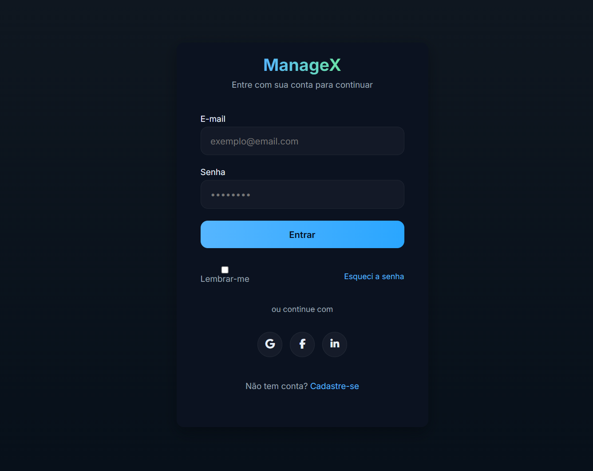
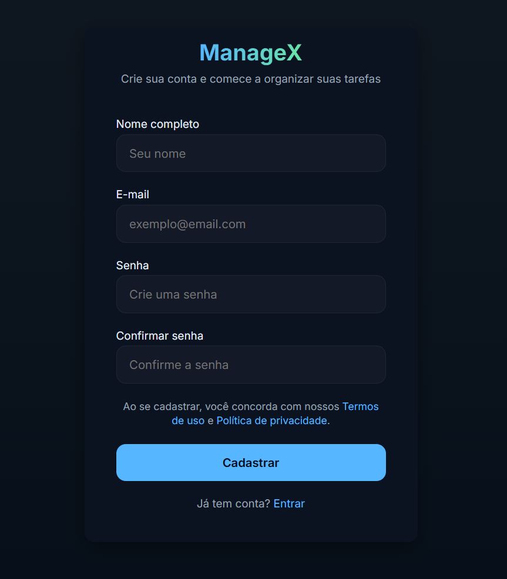
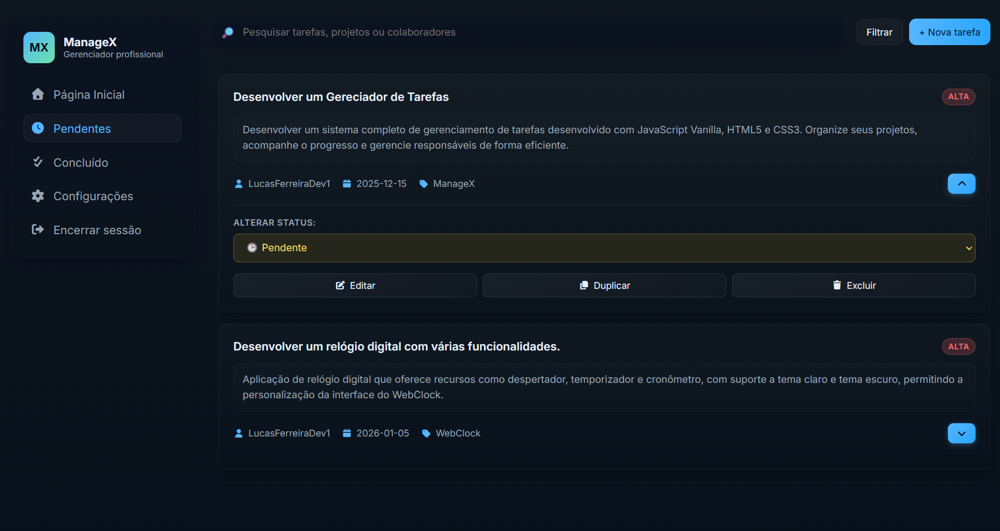

# 📌 ManageX

Sistema completo de gerenciamento de tarefas desenvolvido com JavaScript Vanilla, HTML5 e CSS3. Organize seus projetos, acompanhe o progresso e gerencie responsáveis de forma eficiente.

## 📋 Funcionalidades

- ✅ **CRUD completo** - Criar, visualizar, editar e excluir tarefas
- 🛡️**Sistema de Autenticação** - Login e cadastro de usuários com validação de credenciais e armazenamento no localStorage.
- 🔍 **Busca inteligente** - Filtrar tarefas por nome, projeto ou responsável
- 📊 **Prioridades** - Classificar tarefas por prioridade (Baixa, Média, Alta)
- 📅 **Controle de prazos** - Definir e acompanhar datas de vencimento
- 👥 **Gestão de responsáveis** - Atribuir tarefas a colaboradores
- 📁 **Organização por projetos** - Agrupar tarefas por projeto
- 🔄 **Duplicação de tarefas** - Clone tarefas rapidamente
- 💾 **Armazenamento local** - Dados salvos no navegador
- 📱 **Interface responsiva** - Funciona em desktop e mobile

## 🚀 Tecnologias Utilizadas

- **JavaScript Vanilla** - Sem frameworks ou bibliotecas externas
- **HTML5** - Estrutura semântica
- **CSS3** - Estilização moderna
- **LocalStorage** - Persistência de dados

## 📦 Instalação
```bash
# Clone o repositório
git clone https://github.com/LucasFerreiraDev1/ManageX.git

# Entre no diretório
cd ManageX

# Abra o arquivo index.html no navegador
```

## 💻 Como Usar

1. **Criar tarefa**: Clique no botão "Nova Tarefa" e preencha o formulário
2. **Editar tarefa**: Clique no botão de edição na tarefa desejada
3. **Buscar tarefas**: Digite no campo de busca para filtrar
4. **Alterar status**: Use o dropdown de status para marcar como concluída
5. **Duplicar tarefa**: Use o botão duplicar para criar uma cópia
6. **Excluir tarefa**: Clique no ícone de lixeira

## 📸 Screenshots





## 🎯 Próximas Atualizações

- [ ] Configuração de usuários
- [ ] Light/Dark mode

## 👨‍💻 Autor

Lucas Ferreira - [GitHub](https://github.com/LucasFerreiraDev1)

## 📄 Licença

Este projeto está sob a licença MIT.
